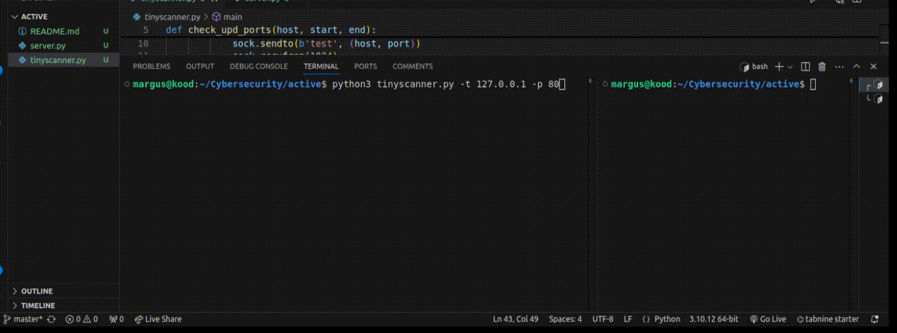

# [active](https://github.com/01-edu/public/tree/master/subjects/cybersecurity/active)

## About

This is a simple port scanner which tells if a port is open or closed.

You can compare ports to doors in a build. Just like  door leads to a certain room, a port is used to transfer certain type of data.
For example port 80 is used for standard web browsing(HTTP) and port 443 is used for
secure web browsing(HTTPS).

If a port is left open by accident or lack of knowledge pentesting open ports can help identify ports that are unnecessarily exposed to public.

## How the program works

In case of TCP port check, it tries to create a connection to the host and if it is successful that eans the port is open. In case of UDP port check things are a little more difficult since the UDP is connectionless so you can't establish a direct connection like with TCP. This program sends data to the UDP port and waits for response. If a response is received, the port is open. If there’s no response, the port may be closed or filtered by a firewall.

## Usage


- Check TCP port: 
    ```bash
    python3 tinyscanner.py -t [HOST] -p [PORT]
- Check UDP port:
    ```bash
    python3 tinyscanner.py -u [HOST] -p [PORT]
- You can also check for a range of ports for example:
    ```bash
    python3 tinyscanner.py -t 127.0.0.1 -p 80-90
- There is also server.py available which creats a basic udp server with port 8080 for testing purposes:
    ```bash
    python3 server.py

## Audit
 

 [Audit Questions](https://github.com/01-edu/public/tree/master/subjects/cybersecurity/active/audit)


## Autor
[MargusT](https://01.kood.tech/git/MargusT)

## Warning
⚠️ These methods and tools are for educational purposes only, so that you have a better understanding of how to protect against similar vulnerabilities. You must ensure that you do not attempt any exploit-type activity without the explicit permission of the owner of the machine, system or application. Failure to obtain permission risks breaking the law.