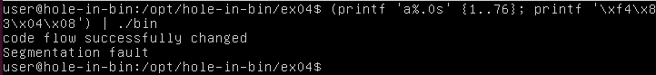
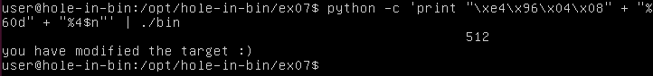
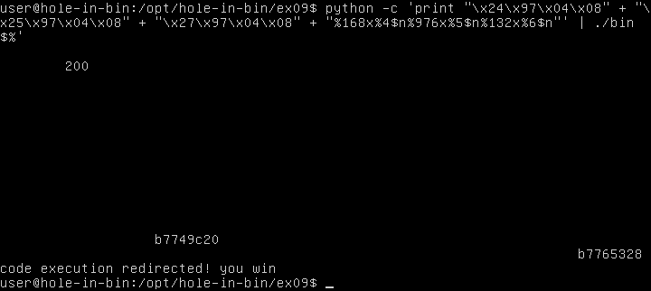

# [hole-in-bin](https://github.com/01-edu/public/tree/master/subjects/cybersecurity/hole-in-bin)

## About

This project consists of 12 exercises focused on exploiting vulnerabilities in provided binaries. Using `objdump` and `GDB`, I performed disassembly and binary analysis to identify vulnerabilities. The solutions are crafted as one-liners executable in the terminal.

## Excercises

### ex00
Readme of this exercise states that the level is completed when you see the message: "You have changed the 'modified' variable"

After disassembling the binary with `objdump` and analyzing the code, I found a vulnerability in the `main` section of the program. The program takes user input using the `gets` function, which is dangerous because it does not check the length of the input, making it vulnerable to a buffer overflow.

In the program, 96 bytes are allocated for local variables on the stack. The input buffer starts 28 bytes into this space , which means the buffer can hold 64 bytes of data (96 - 28 = 64). If a user inputs more than 64 bytes, the excess data will overwrite adjacent memory, including variables or saved registers. So the program can be simply exploited by entering 64 + 1 characters(e.g "A") to the input and this will give you the message that was required in the readme file. 
 

### ex01
The level is completed when you see the message: "you have correctly got the variable to the right value"

This time, instead of providing input interactively, you need to pass an argument when executing the program. Upon analyzing the assembly code, it was revealed that the program uses strcpy to handle the input argument. Like gets, strcpy is vulnerable to buffer overflow because it does not check the size of the input.

After the strcpy function call, the program compares the argument to the value 0x61626364, which corresponds to the string "abcd" in ASCII. Since my system uses little-endian byte order, the bytes are stored in reverse order in memory, meaning I need to provide the string "dcba" instead of "abcd" to match the comparison.

To trigger the desired message, I need to exploit the buffer overflow by entering an argument consisting of 64 characters, followed by "dcba". 
 

### ex02
The level is completed when you see the message: "you have correctly modified the variable"

This level is similar to the previous ones, but this time you need to provide an environment variable named `GREENIE`. The program uses a 64-byte buffer, and at the end, it compares the input to the value `0xD0A0D0A`.

The correct value for GREENIE is: `"a" * 64 + '\x0a\x0d\x0a\x0d'.`
 

### ex03
The level is completed when you see the message: "code flow successfully changed"

The program required regular input, and analysis of the assembly code showed it would quit if the input was incorrect. The buffer size was 64 bytes, and creating a buffer overflow allowed manipulation of the control flow.

A deeper look at the objdump revealed a `<win>` section at address `0x8048424`, which I needed to target. Considering the little-endian byte order, the correct input is:`"a" * 64 + '\x24\x84\x04\x08'`.
 

### ex04
The level is completed when you see the message: "code flow successfully changed"

This solution to this excercise is almost identical to the previous one, only the buffer size is increased. You have to reach `<win>` at `0x80483f4`. The correct input is: `"a" * 76 + '\xf4\x83\x04\x08'`.
 

### ex05
The level is completed when you see the message: "you have hit the target correctly"

In here the `<main>` section doesnt do much but before quitting it calls section `<vuln>`. Analysing that part revealed that sprintf is used there which is again not a safe function because it doesnt check the buffer so it can be exploited. At one point there is a comparison with `0xdeadbeef` which is likely the payload we need to send after overloading the buffer. I sent the payload via argument,  the correct input is: `"a" * 64 + '\xef\xbe\xad\xde'`.
 

### ex06
This excercise is broken and was skipped.

### ex07
The level is completed when you see the message: "you have modified the target"

This exploit takes advantage of a format string vulnerability to write a specific value `(0x40)` to a target memory address `(0x80496e4)`. By passing the memory address and carefully controlling the number of characters printed, we manipulate the program to write the desired value. The exploit works by printing 60 characters using the `%60d` format, followed by `%4$n`, which writes the total number of characters printed (64 in total) to the address stored as the 4th argument on the stack, effectively setting the value at `0x80496e4` to `0x40`. The correct input is: `python -c 'print "\xe4\x96\x04\x08" + "%60d" + "%4$n"'`.

### ex08
The level is completed when you see the message: "you have modified the target"

This exercise is similar to the previous one, but this time we need to specify the addresses of the first three bytes of the target location (`0x80496f4`, `0x80496f5`, and `0x80496f6`). We must print the correct amount of characters to each byte to ensure the target variable is set to the desired value. The correct input is: `python -c 'print "\xf4\x96\x04\x08" + \xf5\x96\x04\x08" + \xf6\x96\x04\x08" + "%56x%12$n%17x%13$n%173x%14$n"'`.

### ex09
The level is completed when you see the message: "code execution redirected"

In this level, the approach involves understanding the Global Offset Table (GOT), which stores references to functions and variables. Instead of overwriting the return address as in previous levels, the exploit targets the GOT entry for an exported function, specifically the `<exit>` function. The goal is to redirect the execution flow to a custom address when `<exit>` is called. Using objdump -TR, we find that the `<exit>` function's address in the GOT is at `0x08049724`. By overwriting this with the address of the `<hello>` function (`0x080484b4`), we can redirect execution. 
The correct input is: `python -c 'print "\x24\x97\x04\x08" + \x25\x97\x04\x08" + \x27\x97\x04\x08" + "%168x%4$n%976x%5$n%132x%6$n"'`.

### ex10
The level is completed when you see the message: "level passed"

This level can be exploited similarily to `ex05`. Analysing the objdump showed that there are two functions `<winner>` and `<nowinner>` and we have to overflow to buffer to replace the `nowinner` addres with the `winner` address (`0x08048464`). The correct input is: `python -c 'print "a"*72 + "\x64\x84\x04\x08"'`.

### ex11
The level is completed when you see the message: "and we have a winner"

This exercise takes two arguments and stores them in dynamically allocated memory on the heap. To trigger the correct message, we need to redirect the execution flow to the `<winner>` function by exploiting a buffer overflow that modifies the heap.

Using `GDB`, we found that there is a `20`-byte offset between the start of the first argument and the pointer to the second argument. To overwrite the pointer with the address of the `<puts>` function's GOT entry (`0x8049774`), the first argument must overflow the buffer by 20 bytes, followed by the address of the puts GOT entry. The second argument should be the address of the winner function (`0x8048494`). The correct input is: `python -c 'print "a"*20 + "\x74\x97\x04\x08"' python -c 'print "\x94\x84\x04\x08"'`.

## Audit
 [Audit Questions](https://github.com/01-edu/public/tree/master/subjects/cybersecurity/hole-in-bin/audit)

## Autor
[MargusT](https://01.kood.tech/git/MargusT)

## Warning
⚠️ These methods and tools are for educational purposes only, so that you have a better understanding of how to protect against similar vulnerabilities. You must ensure that you do not attempt any exploit-type activity without the explicit permission of the owner of the machine, system or application. Failure to obtain permission risks breaking the law.