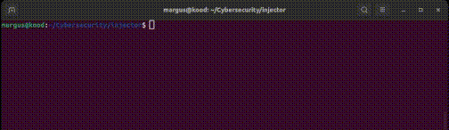

# [injector](https://github.com/01-edu/public/tree/master/subjects/cybersecurity/injector)

## About

Injector is a Golang script that combines two programs into a single executable. It reads the binary data of both programs and generates a new executable that sequentially runs each program."

## Usage
    go run injector.go `path to exec1` `path to exec2`

## Audit
 

 [Audit Questions](https://github.com/01-edu/public/tree/master/subjects/cybersecurity/injector/audit)

## Autor
[MargusT](https://01.kood.tech/git/MargusT)

## Warning
⚠️ These methods and tools are for educational purposes only, so that you have a better understanding of how to protect against similar vulnerabilities. You must ensure that you do not attempt any exploit-type activity without the explicit permission of the owner of the machine, system or application. Failure to obtain permission risks breaking the law.