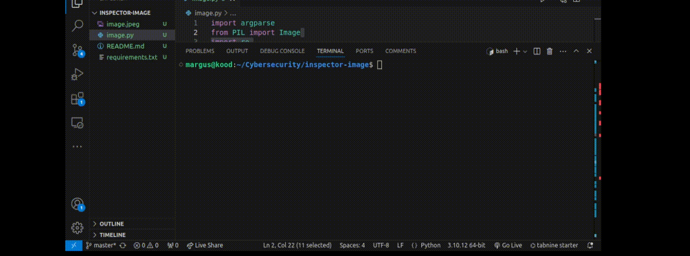

# [inspector-image](https://github.com/01-edu/public/tree/master/subjects/cybersecurity/inspector-image)

## About

This is a script which gets GPS information about where the photo was taken and displays hidden pgp key if present.

## Steganography

Steganography is a technique for hiding information within something else, so the hidden message isn't obvious. Unlike encryption, which scrambles data to make it unreadable, steganography conceals the very existence of the message itself.

## Dependencies

- [Pillow](https://python-pillow.org/)

## Usage

- Setup:   
     ```bash
     git clone https://01.kood.tech/git/MargusT/inspector-image.git
     cd inspector-image
     pip install -r requirements.txt
- Get the location the photo was taken: 
    ```bash
    python3 image.py -map image.jpeg
- SGet the hidden pgp key:
    ```bash
    python3 image.py -steg image.jpeg

## Audit
 

 [Audit Questions](https://github.com/01-edu/public/tree/master/subjects/cybersecurity/inspector-image/audit)


## Autor
[MargusT](https://01.kood.tech/git/MargusT)

## Warning
⚠️ These methods and tools are for educational purposes only, so that you have a better understanding of how to protect against similar vulnerabilities. You must ensure that you do not attempt any exploit-type activity without the explicit permission of the owner of the machine, system or application. Failure to obtain permission risks breaking the law.